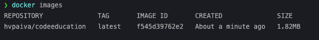

# Desafio Docker

Um simples e leve "hello-world-like" em Go.

Para criar a imagem:
```bash
docker build -t hvpaiva/codeeducation .
```

Para executar:
```bash
docker run hvpaiva/codeeducation
```

> Imagem já está no Image Registry, portanto é possível executar sem buildar. [Docker Hub](https://hub.docker.com/repository/docker/hvpaiva/codeeducation)

A imagem cumpre o requisito de ser <2Mb:
